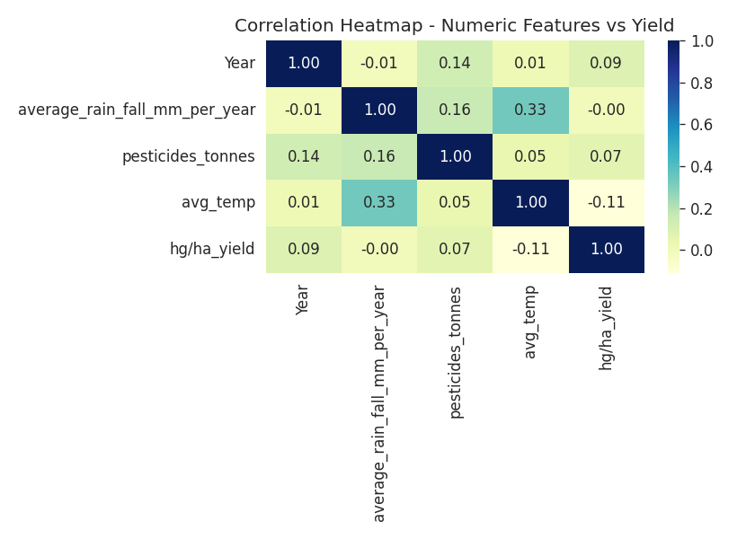
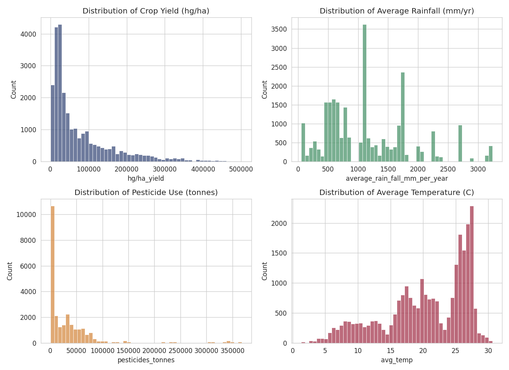

# Crop Yield Prediction — ML Summative (Linear Regression → API → Flutter)

## Mission & Problem
Food-security planning across Africa depends on forecasting crop yield ahead of
harvest. This project predicts crop yield (hg/ha) from country, crop type,
year, rainfall, pesticide use, and average temperature, so planners can flag
likely shortfalls before the season ends.

**Dataset:** FAO / World Bank crop data, 28,242 rows, 101 countries (incl.
Rwanda), 10 crops. Source: [ManikantaSanjay/crop_yield_prediction_regression](https://github.com/ManikantaSanjay/crop_yield_prediction_regression) (`yield_df.csv`).

## Live Links
- **API (Swagger UI):** `https://YOUR-RENDER-APP-NAME.onrender.com/docs` ← **TODO: replace after deploying (see below)**
- **YouTube demo video:** `PASTE_YOUTUBE_LINK_HERE` ← **TODO: replace after recording (see [Task 4](#task-4--video-demo-7-min))**

## Repo Structure
```
linear_regression_model/
├── summative/
│   ├── linear_regression/
│   │   ├── multivariate.ipynb       # EDA, feature engineering, 4-model comparison, saved model
│   │   ├── train_pipeline.py        # same pipeline as a plain script
│   │   ├── yield_df.csv             # dataset
│   │   └── plots_*.png              # exported charts
│   ├── API/
│   │   ├── prediction.py            # FastAPI app (predict + retrain endpoints)
│   │   ├── best_model.joblib        # saved RandomForest pipeline (best model)
│   │   ├── model_metadata.json      # feature ranges / categories used for validation
│   │   └── requirements.txt
│   ├── FlutterApp/
│   │   ├── lib/main.dart            # single-page prediction app
│   │   └── pubspec.yaml
│   ├── pyproject.toml
│   └── uv.lock
└── README.md
```

## Key Visualizations

**Correlation heatmap** — `pesticides_tonnes` correlates most strongly with yield; rainfall
correlates weakly at the aggregate level since its effect depends on crop/region; temperature
shows a mild negative relationship. This is why `Area`/`Item` (categorical, not shown in a
numeric correlation) end up mattering more than any single climate variable.



**Feature distributions** — yield, rainfall, and pesticide use are all right-skewed (a small
number of high-input/high-yield crop-country pairs pull the tail), which is part of why
tree-based models outperform the linear models below.



## Task 1 — Model
Open `summative/linear_regression/multivariate.ipynb`. It:
1. Loads and cleans the dataset (dedupe, drop nulls: 28,242 → 25,932 rows)
2. Visualizes correlations, distributions, and yield-by-crop with interpretation
3. Engineers features: one-hot encodes `Area`/`Item`, standardizes numeric columns
4. Trains and compares 4 regressors: **SGDRegressor** (stochastic gradient descent),
   **OLS LinearRegression**, **DecisionTreeRegressor**, **RandomForestRegressor**
5. Plots the SGD train/test loss curve and a before/after best-fit scatter plot
6. Saves the best model (**RandomForest, test R² ≈ 0.96**) to `best_model.joblib`
7. Runs a sample prediction on one held-out row (hands off to Task 2)

To re-run from scratch:
```bash
cd summative
uv sync
uv run jupyter nbconvert --to notebook --execute --inplace linear_regression/multivariate.ipynb
```

## Task 2 — API
```bash
cd summative/API
pip install -r requirements.txt   # or: uv sync from summative/
uvicorn prediction:app --reload
```
Visit `http://127.0.0.1:8000/docs` for Swagger UI. Endpoints:
- `POST /predict` — body: `{area, item, year, average_rain_fall_mm_per_year, pesticides_tonnes, avg_temp}`
- `POST /retrain` — multipart file upload of a CSV with the same schema as `yield_df.csv`; retrains and overwrites `best_model.joblib`
- `GET /health` — status check

**CORS:** explicit allow-list (no wildcard `*`), `GET`/`POST` only, `Content-Type`/`Authorization`
headers only, credentials disabled — see comments in `prediction.py` for full reasoning.

### Deploying to Render (free tier)
This repo includes [`render.yaml`](render.yaml) (a Render Blueprint), so the easiest path is:
1. Push this repo to GitHub (already done if you're reading this on GitHub).
2. On [render.com](https://render.com) → **New** → **Blueprint** → connect this repo → Render
   auto-detects `render.yaml` (root dir `summative/API`, build/start commands, health check) → **Apply**.
3. Wait for the first deploy to finish, then open `https://<your-service-name>.onrender.com/docs`
   to confirm Swagger UI loads.
4. Paste that URL into the **Live Links** section above and into `kApiBaseUrl` in
   [`FlutterApp/lib/main.dart`](summative/FlutterApp/lib/main.dart#L10).

Manual alternative (New → Web Service instead of Blueprint): root directory
`summative/API`, build command `pip install -r requirements.txt`, start command
`uvicorn prediction:app --host 0.0.0.0 --port $PORT`.

Note: Render's free tier spins down on idle, so the first request after inactivity can take
~30–60s to respond (cold start) — worth mentioning in the video if a Swagger call looks slow.

## Task 3 — Flutter App
Single page: 6 text fields (Area, Item, Year, Rainfall, Pesticides, Avg Temp) matching
the 6 prediction inputs, a **Predict** button, and a result/error display area.

```bash
cd summative/FlutterApp
flutter pub get
flutter run   # run on a connected device/emulator
```
Before running, set `kApiBaseUrl` in `lib/main.dart` to your deployed Render URL.

## Task 4 — Video Demo (≤7 min)
Script/checklist in `VIDEO_DEMO_SCRIPT.md` at the repo root.

## Model Performance Summary
| Model | Test MSE | Test R² |
|---|---|---|
| **RandomForest (saved/best)** | ~2.99e8 | **0.959** |
| DecisionTree | ~5.62e8 | 0.922 |
| OLS LinearRegression | ~1.82e9 | 0.749 |
| SGD LinearRegression | ~1.87e9 | 0.742 |

Tree-based models win because yield depends on non-linear interactions between
crop type, country, and climate that a straight-line model can't capture.
